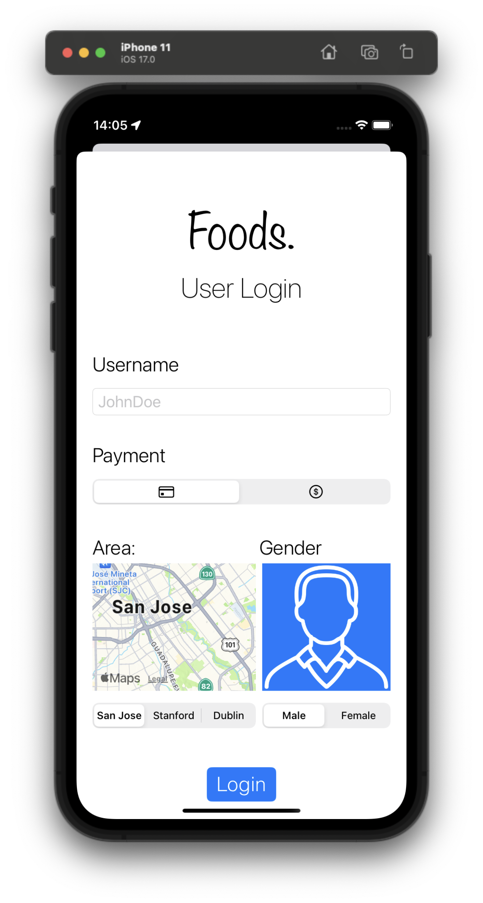
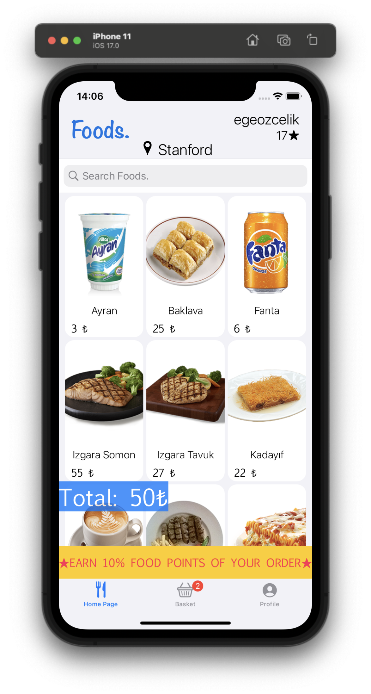
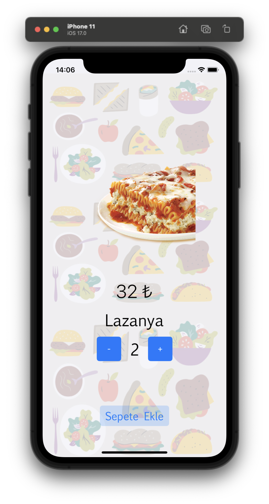
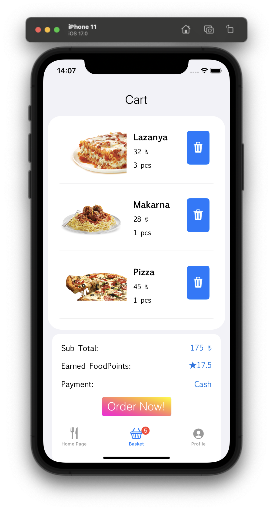
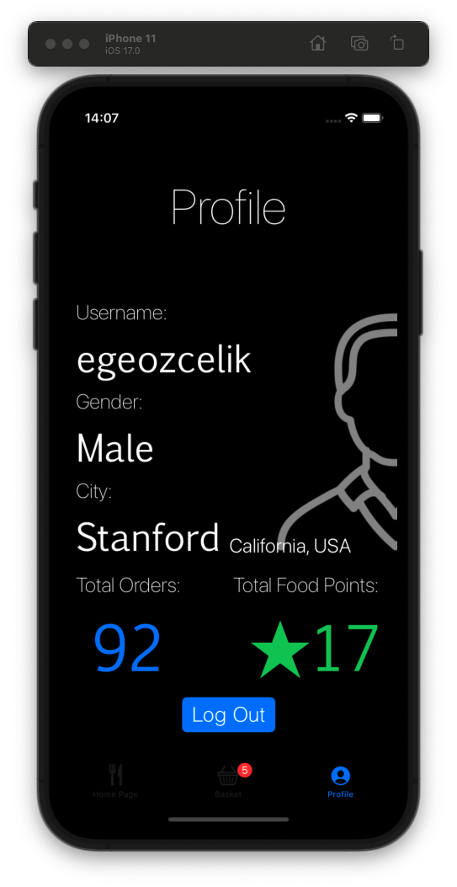
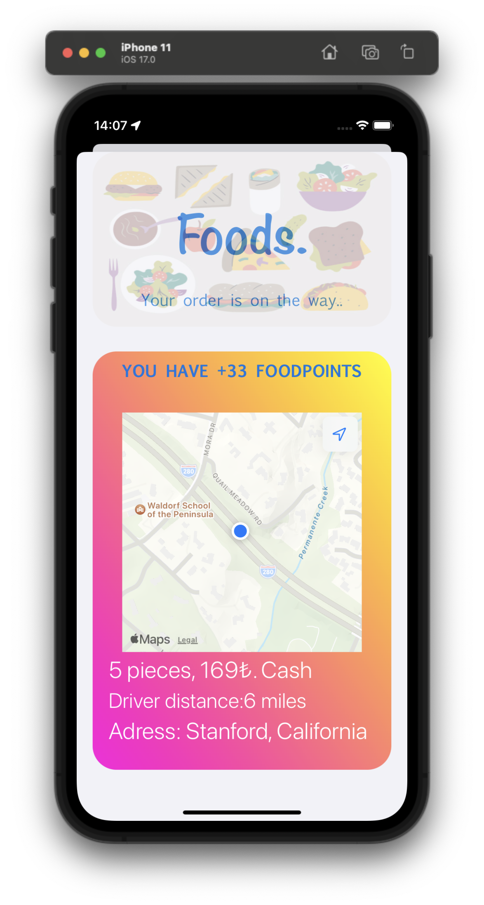

# Foods-app

Used Technologies: 
 - Swift - UI Storyboard
 - User Defaults( for storing dynamic variables)
 - RX Swift(for Reactive Programming)
 - Alamofire(for URL session)
 - Kingfisher( for image handling)
 - MapKit & CoreLocation frameworks( for location and distance operations)

# Pages

    Login Page

    Home Page
    

    Item Details Page
    

    Basket Page
    

    Profile Page
    

    Order Page
    

 
